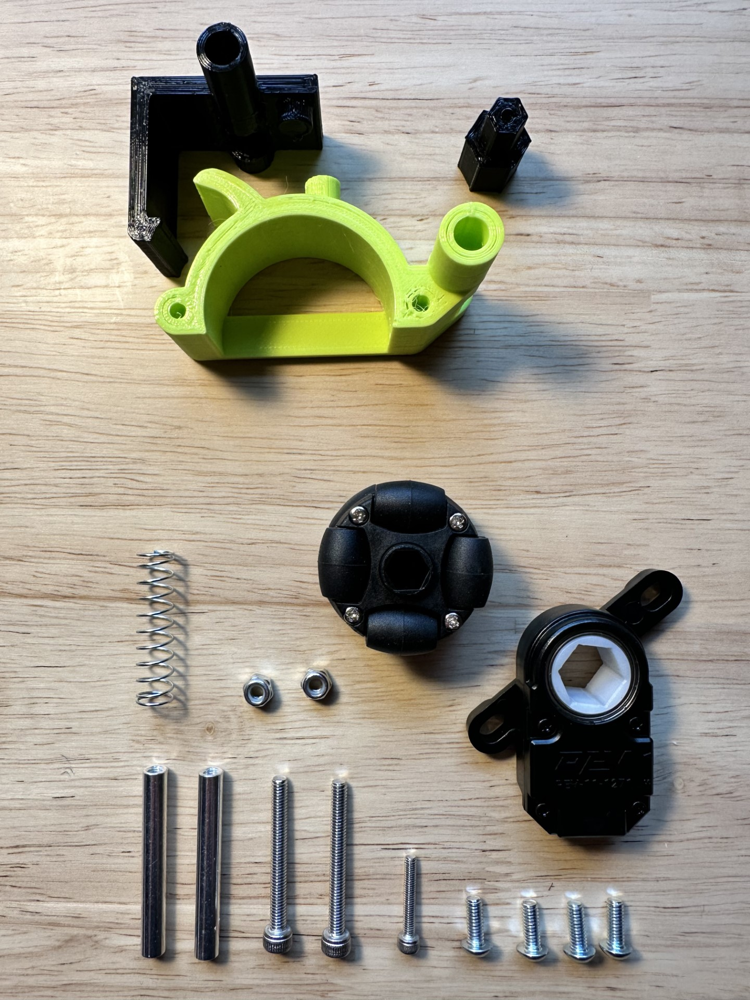
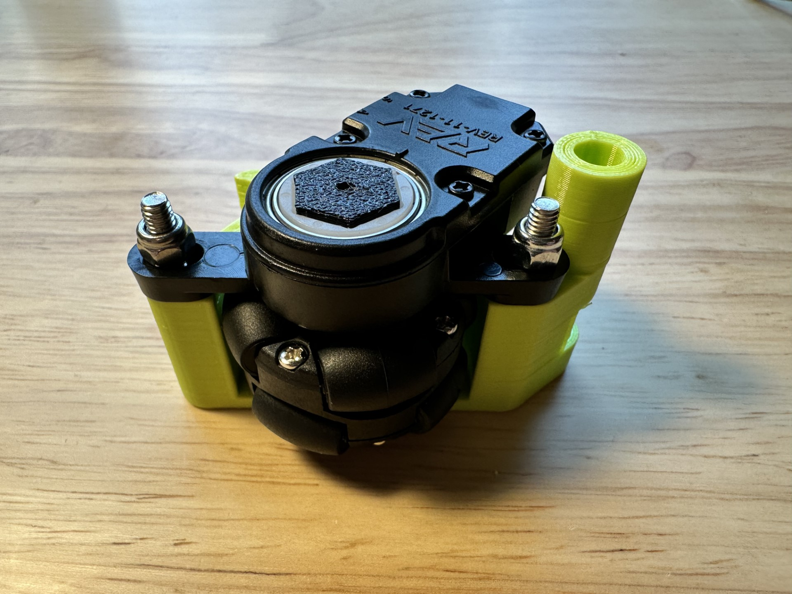
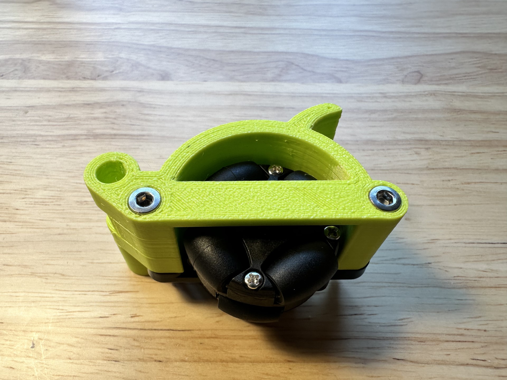
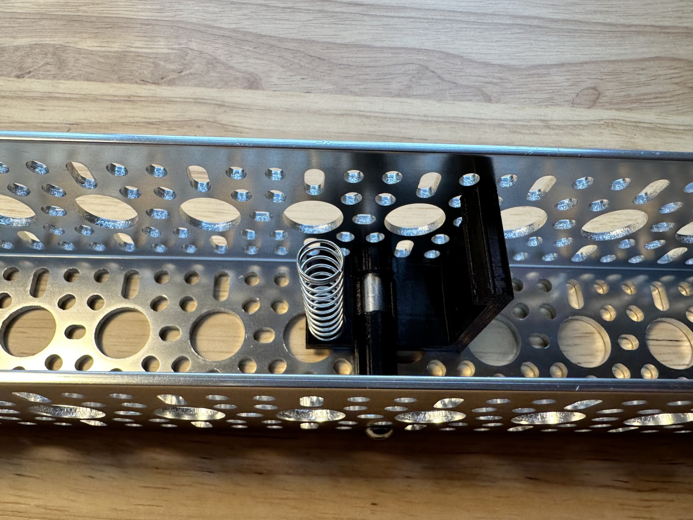
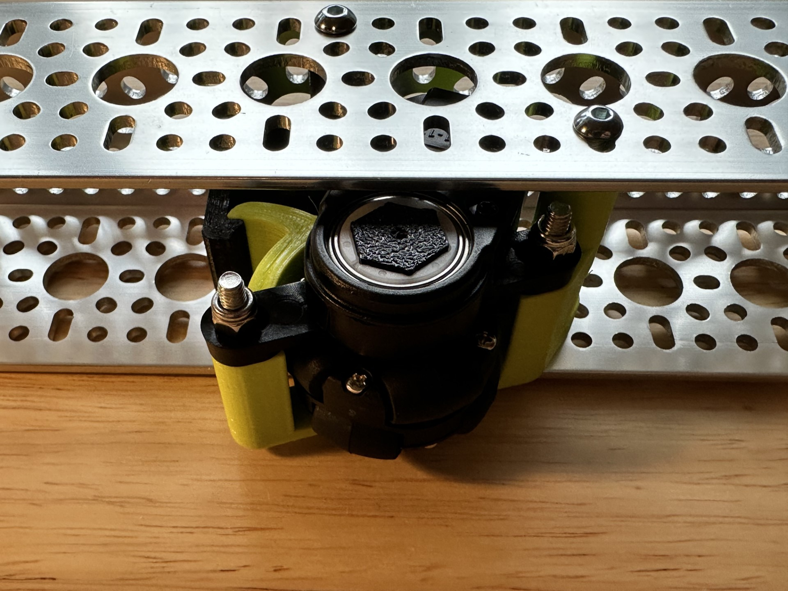

## Background

Robot autonomous operation can be improved with odometry from dead wheels, given that they are less susceptible from slippage during acceleration and breaking. Dead wheels require an encoder and an omni wheel to be assembled is a way that they can be added to the robot chassis.

The goal is to have the whole assembly to fit inside a standard Gobilda U-Channel. We've looked into [Open Odometry](https://openodometry.weebly.com/) but the assembly required too many parts, thus we've opted for designing our own.

## Bill of Materials

| Item                           | Quantity | Link                                                                                                                      |
|--------------------------------|----------|---------------------------------------------------------------------------------------------------------------------------|
| REV Through Bore Encoder       | 1        | [Link to Product](https://www.revrobotics.com/rev-11-1271/)                                                               |
| 38mm Omni Wheel                | 1        | [Link to Product](https://www.aliexpress.us/item/2251832788059198.html)                                                   |
| M3x18mm socket head hex screw  | 1        | (Comes with the Wheel)                                                                                                    |
| M4x10mm button head hex screws | 1        |                                                                                                                           |
| M4x35mm socket head hex screw  | 2        |                                                                                                                           |
| GoBilda 43mm standoff          | 2        | [Link to Product][GoBilda-Standoff-43]                                                                                    |
| Neiko Spring 23/64’’ x 1-3.8’’ | 1        |                                                                                                                           |
| M4 Nylon Nuts                  | 2        | [Link to Product](https://www.gobilda.com/2812-series-zinc-plated-steel-nylon-insert-locknut-m4-x-0-7mm-7mm-hex-25-pack/) |
| Printed: Hexagonal Axel        | 1        | [Link to STL](https://www.thingiverse.com/thing:6331996)                                                                  |
| Printed: Wheel Housing         | 1        | [Link to STL](https://www.thingiverse.com/thing:6331996)                                                                  |
| Printed: Encoder Bracket       | 1        | [Link to STL](https://www.thingiverse.com/thing:6331996)                                                                  |

[GoBilda-Standoff-43]: https://www.gobilda.com/1501-series-m4-x-0-7mm-standoff-6mm-od-43mm-length-4-pack/

***

## Assembly Tutorial

### Step 1

Insert the small end of the hexagonal axel into the 38mm omni wheel. Then insert the M3x18mm into the opposite end and tighten until the wheel doesn't wiggle along the axel.

Assembly should look like this:

### Step 2

Place the assembly from step one into the REV Bore Encoder, so the wheel is on the side without the embossed words.

### Step 3

Now, get the Wheel Housing and the two M4x35mm screws. Insert the screws into the two holes of the wheel housing. You should insert them on the side with the embeds for the screw heads. Do not screw in all the way, go until a centimeter of the screw is visible on the opposite side of the Wheel Housing.

### Step 4

Retrieve the assembly you made in Steps 1 and 2. Slide the two attachment arms onto the screws you inserted in Step 3. Get both M4 Nylon nuts and and screw them on gently with your fingers. Now tighten the screws completely to secure the REV encoder to the Wheel Housing (screw heads should be flush with the piece).

### Step 5

Slide the 43mm Standoff into the back hole of the Wheel Housing assembly. 

### Step 6

Now to assemble the Encoder Bracket, you need the specified spring and the second 43mm standoff. Slide the spring onto the protruding circle on the bottom of the bracket (use a little bit of force or twist). Then insert the second standoff through the tube.

Completed Bracket Assembly:

### Step 7 (U-Channel Assembly)

Once you have the two assemblies you'll be able to fit the two into a standard GoBilda u-channel.

## Connecting REV Encoders

From the [FTC Tech Tips](https://ftc-docs.firstinspires.org/en/latest/tech_tips/tech-tips.html):

> Encoder ports 0 and 3 are hardware-counted, but ports 1 and 2 are software-counted. This means higher counts-per-revolution encoders (like the REV Through-Bore Encoder) should be placed on Ports 0 or 3 to ensure counts aren’t missed, and lower counts-per-revolution encoders (like the goBILDA Odometry Pods or most motors) can be connected to any port.

## Additional Resources

* [GM0 Odometry](https://gm0.org/en/latest/docs/software/concepts/odometry.html)
* [Road Runner Paper](https://github.com/acmerobotics/road-runner/blob/master/doc/pdf/Mobile_Robot_Kinematics_for_FTC.pdf)
* [GoBilda Odometry Module](https://www.gobilda.com/odometry-pod-43mm-width-48mm-wheel/)

